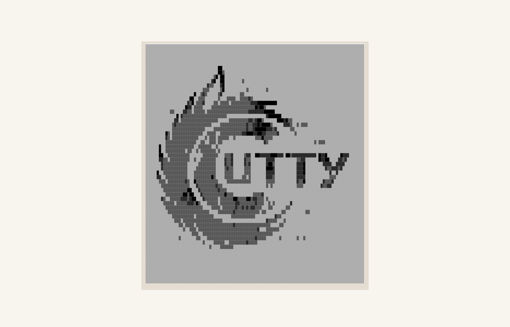

    

<h1 align="center">CuTTY, the Copper Teletype</h1>

  

## About

CuTTY is a modern terminal emulator that comes with sensible defaults, but
allows for extensive [configuration](#configuration). By integrating with other
applications, rather than reimplementing their functionality, it manages to
provide a flexible set of [features](./docs/features.md) with high performance.
The supported platforms currently consist of BSD, Linux, macOS and Windows.

CuTTY uses a `wgpu`/`vello` scene renderer and a `parley` text stack. The
terminal core and PTY behavior remain split into the `cutty_terminal` crate.

The software is considered to be at a **beta** level of readiness; there are
a few missing features and bugs to be fixed, but it is already used by many as
a daily driver.

## Features

You can find an overview over the features available in CuTTY [here](./docs/features.md).

## Installation

CuTTY can be installed by using various package managers on Linux, BSD,
macOS and Windows.

Build and installation instructions live in [INSTALL.md](./INSTALL.md).

### Requirements

- A graphics adapter and driver supported by `wgpu`
- [Windows] ConPTY support (Windows 10 version 1809 or higher)

## Configuration

You can find the documentation for CuTTY's configuration in `man 5 cutty`, or
in the source manpage at [extra/man/cutty.5.scd](./extra/man/cutty.5.scd).

CuTTY doesn't create the config file for you, but it looks for one in the
following locations:

1. `$XDG_CONFIG_HOME/cutty/cutty.toml`
2. `$XDG_CONFIG_HOME/cutty.toml`
3. `$HOME/.config/cutty/cutty.toml`
4. `$HOME/.cutty.toml`
5. `/etc/cutty/cutty.toml`

On Windows, the config file will be looked for in:

* `%APPDATA%\cutty\cutty.toml`

## Contributing

A guideline about contributing to CuTTY can be found in the
[`CONTRIBUTING.md`](CONTRIBUTING.md) file.

## FAQ

**_Is it really the fastest terminal emulator?_**

Benchmarking terminal emulators is complicated. CuTTY uses
[vtebench](https://github.com/cutty/vtebench) to quantify terminal emulator
throughput and manages to consistently score better than the competition using
it. If you have found an example where this is not the case, please report a
bug.

Other aspects like latency or framerate and frame consistency are more difficult
to quantify. Some terminal emulators also intentionally slow down to save
resources, which might be preferred by some users.

If you have doubts about CuTTY's performance or usability, the best way to
quantify terminal emulators is always to test them with **your** specific
usecases.

**_Why isn't feature X implemented?_**

CuTTY has many great features, but not every feature from every other
terminal. This could be for a number of reasons, but sometimes it's just not a
good fit for CuTTY. This means you won't find things like tabs or splits
(which are best left to a window manager or [terminal multiplexer][tmux]) nor
niceties like a GUI config editor.

[tmux]: https://github.com/tmux/tmux

## License

CuTTY is released under the [Apache License, Version 2.0](./LICENSE-APACHE).
